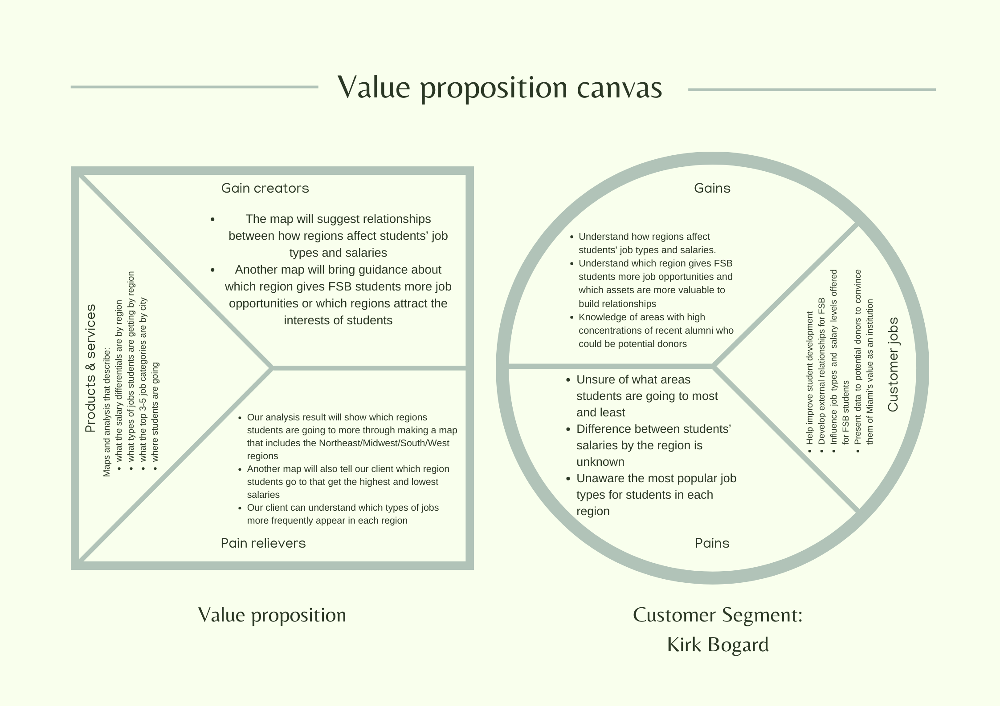

```{r setup, include=FALSE}
knitr::opts_chunk$set(echo = TRUE)
```

## R Markdown

This is an R Markdown document. Markdown is a simple formatting syntax for authoring HTML, PDF, and MS Word documents. For more details on using R Markdown see <http://rmarkdown.rstudio.com>.

When you click the **Knit** button a document will be generated that includes both content as well as the output of any embedded R code chunks within the document. You can embed an R code chunk like this:

```{r cars}
summary(cars)
```

## Including Plots

You can also embed plots, for example:

```{r pressure, echo=FALSE}
plot(pressure)
```

Note that the `echo = FALSE` parameter was added to the code chunk to prevent printing of the R code that generated the plot.

## Audience and Purpose

The purpose of our project is to help Mr. Kirk Bogard raise fund for Farmer School of Business. We will create several maps to clearly show companies in which region are more valuable to try to build external relationships. Audience of our project is shared work producers including people who do the same job as Mr. Kirk Bogard in a team, users who need to know how it done and how to done it better.

## Value Proposition



## Data Description

Our group will be using the FSB data on the employment status of graduates in order to find information about geographic trends The data file is includes survey data on where students are going, what are students' salaries, job opportunities in each region between 2019 to 2021.
