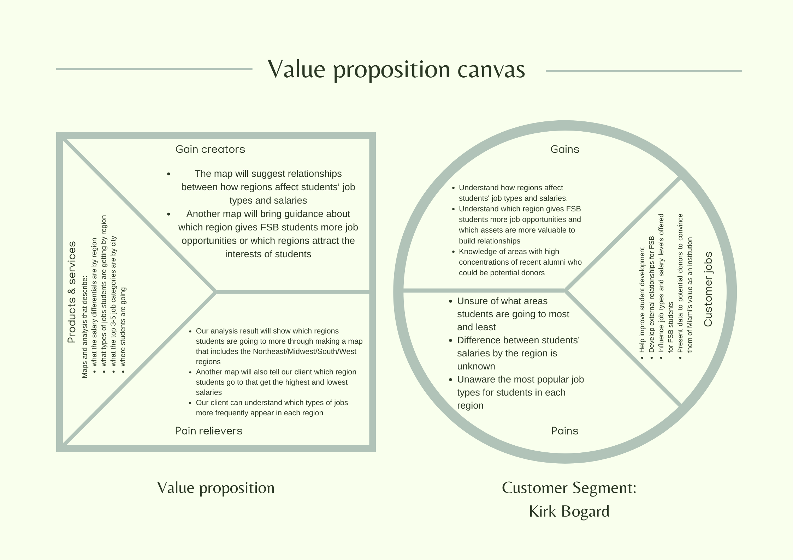

# Project Statement

The purpose of our project is to help Mr. Kirk Bogard raise funds for Farmer School of Business. We will create several graphs and maps to clearly show companies in regions where it is valuable to try to build external relationships. The audience of our project are shared work producers including the team of people who do the same job as Mr. Kirk Bogard, users who need to know how it is done, and how to do it better.



# Clean Data

##### The necessary libraries are loaded into R {.unnumbered}

```{r}
library(dplyr)
```

##### The data is loaded and displayed to check the success of the loading {.unnumbered}

```{r}
df <- readRDS('FSB_BI_Survey_2019_2021.rds')
head(df)
```

##### Missing values are evaluated {.unnumbered}

```{r}
colSums(is.na(df))
```

##### Variables are removed due to lack of understanding, missing values, and relevance {.unnumbered}

```{r}
# Variables "BBRJ", "Study Abroad Courtesy Account", and "Transfer Work" are removed due to lack of understanding and missing variables

df <- df[, !(names(df) %in% c("BBRJ","Study Abroad Courtesy Account", "Transfer Work (Pre-Banner)"))]

# Variables without relevance to the research question are removed

df <- df[, !(names(df) %in% c("nmajor", "Business Direct Admit", "First Generation College Stdnt", "Combined Bacc and Masters", "Dean's List", "FSB Scholars", "Honors Program", "President's List", "Cum Laude", "Magna Cum Laude", "Summa Cum Laude", "University Honors","UniversityHonors w/Distinction", "year.x", "latin_honors", "survey_gradprogram", "survey_gradschool", "survey_internfour","survey_internone", "survey_internships", "survey_internthree", "survey_interntwo"))]
```

##### The data is displayed again and the dimensions are checked to confirm removal of variables {.unnumbered}

```{r}
head(df)
dim(df)
```

##### Rows that contain a null value for "survey_state" are removed {.unnumbered}

```{r}
df <- df[!is.na(df$survey_state), , drop = FALSE]
```

##### Only rows where "accepted fulltime job" is the value in "survey_plans" are kept

```{r}
df <- df %>% filter(survey_plans == "accepted fulltime job")
```

##### The data is checked for remaining null values {.unnumbered}

```{r}
colSums(is.na(df))
```

##### Null values are imputed {.unnumbered}

```{r}
# Missing values in variables 'survey_city', 'survey_company', and 'survey_deptfunc' are imputed with "Unknown"

df[, c("survey_city", "survey_company", "survey_deptfunc")] <- lapply(df[, c("survey_city", "survey_company", "survey_deptfunc")], function(x) ifelse(is.na(x), "Unknown", x))

# Missing values in variables 'survey_offers', 'survey_pref_field', and 'survey_pref_loc' are imputed with "None"

df[, c("survey_offers", "survey_pref_field", "survey_pref_loc")] <- lapply(df[, c("survey_offers", "survey_pref_field", "survey_pref_loc")], function(x) ifelse(is.na(x), "None", x))

# The missing values in the 'survey_salary' variable are imputed with the mean salary

df$survey_salary[is.na(df$survey_salary)] <- mean(df$survey_salary, na.rm = TRUE)
```

##### The data is checked for remaining null values {.unnumbered}

```{r}
colSums(is.na(df))
```

##### 'survey_state' is converted to uppercase and spaces are removed {.unnumbered}

```{r}
df$survey_state <- toupper(df$survey_state)
df$survey_state <- trimws(df$survey_state)
```

##### state names are standardized to abbreviations and countries and cities outside the US are removed {.unnumbered}

```{r}
df$survey_state <- recode(df$survey_state,
  'ALABAMA' = 'AL',
  'ALASKA' = 'AK',
  'ARIZONA' = 'AZ',
  'ARKANSAS' = 'AR',
  'CALIFORNIA' = 'CA',
  'COLORADO' = 'CO',
  'CONNECTICUT' = 'CT',
  'DELAWARE' = 'DE',
  'FLORIDA' = 'FL',
  'GEORGIA' = 'GA',
  'IDAHO' = 'ID',
  'ILLINOIS' = 'IL',
  'INDIANA' = 'IN',
  'IOWA' = 'IA',
  'KANSAS' = 'KS',
  'KENTUCKY' = 'KY',
  'LOUISIANA' = 'LA',
  'MAINE' = 'ME',
  'MARYLAND' = 'MD',
  'MASSACHUSETTS' = 'MA',
  'MICHIGAN' = 'MI',
  'MINNESOTA' = 'MN',
  'MISSISSIPPI' = 'MS',
  'MISSOURI' = 'MO',
  'MONTANA' = 'MT',
  'NEBRASKA' = 'NE',
  'NEVADA' = 'NV',
  'NEW HAMPSHIRE' = 'NH',
  'NEW JERSEY' = 'NJ',
  'NEW MEXICO' = 'NM',
  'NEW YORK' = 'NY',
  'NORTH CAROLINA' = 'NC',
  'NORTH DAKOTA' = 'ND',
  'OHIO' = 'OH',
  'OKLAHOMA' = 'OK',
  'OREGON' = 'OR',
  'PENNSYLVANIA' = 'PA',
  'RHODE ISLAND' = 'RI',
  'SOUTH CAROLINA' = 'SC',
  'SOUTH DAKOTA' = 'SD',
  'TENNESSEE' = 'TN',
  'TEXAS' = 'TX',
  'UTAH' = 'UT',
  'VERMONT' = 'VT',
  'VIRGINIA' = 'VA',
  'WASHINGTON' = 'WA',
  'WEST VIRGINIA' = 'WV',
  'WISCONSIN' = 'WI',
  'WYOMING' = 'WY',
  'OH, USA' = 'OH',
  'OHIO/ UNITED STATES' = 'OH',
  'OH/US' = 'OH',
  'OHIO / THE UNITED STATES' = 'OH',
  'OHIO/UNITED STATES' = 'OH',
  'OH, USA' = 'OH',
  'OHIO / USA ' = 'OH',
  'OH/USA' = 'OH',
  'OHIO/UNITED STATES' = 'OH',
  'OHIO / UNITED STATES' = 'OH',
  'OHIO/USA' = 'OH',
  'OH, USA' = 'OH',
  'OHIO / USA' = 'OH',
  'IL/ USA' = 'IL',
  'ILLINOIS / USA' = 'IL',
  'ILLINOIS, USA' = 'IL',
  'ILLINOIS/USA' = 'IL',
  'ILLINOIS/ US' = 'IL',
  'IL, UNITED STATES' = 'IL',
  'IL, US' = 'IL',
  'IL, USA' = 'IL',
  'IL/USA' = 'IL',
  'BELIZE' = 'DELETE',
  'CANADA' = 'DELETE',
  'CHINA' = 'DELETE',
  'FUJIAN PROVINCE' = 'DELETE',
  'INDIA' = 'DELETE',
  'IRELAND' = 'DELETE',
  'MONTENEGRO' = 'DELETE',
  'TBA / USA' = 'DELETE',
  'TURKEY' = 'DELETE',
  'UNITED KINGDOM' = 'DELETE',
  'ZHEJIANG PROVINCE' = 'DELETE',
  'COLORADO/ UNITED STATES' = 'CO',
  'D.C.' = 'DC',
  'DISTRICT OF COLUMBIA' = 'DC',
  'WASHINGTON D.C/UNITED STATES' = 'DC',
  'GEORGIA, USA' = 'GA',
  'IN / USA' = 'IN',
  'MA / USA' = 'MA',
  'MASSACHUSETTS, USA' = 'MA',
  'MI / U.S.' = 'MI',
  'NEW YORK, USA' = 'NY',
  'TEXAS/ USA' = 'TX',
  'TX/USA' = 'TX',
  'UNITED STATES' = 'USA',
  'US' = 'USA',
  'VIRGINIA (VA)' = 'VA',
  'VIRGINIA/ USA' = 'VA',
  'WISCONSIN / USA' = 'WI',
  'MICHIGAN, DETROIT' = 'MI'
)
```

##### Rows with state values marked for deletion are removed {.unnumbered}

```{r}
df <- df %>% filter(survey_state != "DELETE")
```

##### 'survey_state' values are further standardized

```{r}
df$survey_state <- recode(df$survey_state,
  'COLORADO/ UNITED STATES' = 'CO',
  'D.C.' = 'DC',
  'DISTRICT OF COLUMBIA' = 'DC',
  'WASHINGTON D.C/UNITED STATES' = 'DC',
  'GEORGIA, USA' = 'GA',
  'IN / USA' = 'IN',
  'MA / USA' = 'MA',
  'MASSACHUSETTS, USA' = 'MA',
  'MI / U.S.' = 'MI',
  'NEW YORK, USA' = 'NY',
  'TEXAS/ USA' = 'TX',
  'TX/USA' = 'TX',
  'UNITED STATES' = 'USA',
  'US' = 'USA',
  'VIRGINIA (VA)' = 'VA',
  'VIRGINIA/ USA' = 'VA',
  'WISCONSIN / USA' = 'WI',
  'MICHIGAN, DETROIT' = 'MI'
)
```

```{r}
df[5, "survey_state"] <- "IL"
df_final[1107, "survey_state"] <- "IL"
df_final[1438, "survey_state"] <- "IL"
df_final[1480, "survey_state"] <- "MI"
```

##### 'survey_city' is column is standardized and errors are amended {.unnumbered}

```{r}
df$survey_city <- toupper(df$survey_city)
df$survey_city <- trimws(df$survey_city)
```

```{r}
df$survey_city <- recode(df$survey_city,
  'NEW YORK CITY' = 'NEW YORK',
  'NYC' = 'NEW YORK',
  'CINCINATTI' = 'CINCINNATI',
  'WITCHITA' = 'WICHITA',
  'MILWAUKWEE' = 'MILWAUKEE',
  'CINCINNATI, OH' = 'CINCINNATI')
```

##### Rows with missing values in 'survey_city' are removed {.unnumbered}

```{r}
df <- df %>% filter(!is.na(survey_city))
```

##### The modified data is saved to a new CSV file {.unnumbered}

```{r}
write.csv(df, file = "FSB_Survey.csv", row.names = FALSE)
```

# Explanation of Cleaning the Data

We started by getting an overview the data structure and missing values for each variable. Then, we deleted several variables which do not relate to our project or are not clear enough to be useful, including BBRJ, Study Abroad Courtesy Account, Transfer Work, latin_honors and 25 others. We deleted these variables because they were not relevant to our research question. We then removed the rows that contained missing values for the state the job was in, as no information could be gathered for the project without this information. . For some variables such as 'survey_offers', 'survey_cities' we imputed them with "Unknown" or "None" to make clear the meaning of the null values. We also imputed the salary with the mean in preparation for the possibility of using that variable for further analysis requiring numeric data. Finally, we exported the cleaned data into "FSB_Survey.csv" in order to use for future analysis.

# Computing Environment

```{r}
sessionInfo()
```

We ran the code sessionInfo() function to determine the version of r studio used to ensure our code can be reproduced. We have also saved our original file "FSB_BI_Survey_2019_2021.rds". Thus, we can rerun the code in the future to ensure reproducibility.

# Deliverables

# Region/State by Average Salaries {data-orientation="columns"}

```{r,echo=FALSE}
library(dplyr)
library(readr)
library(magrittr)

df <- read.csv('FSB_Survey.csv')
cities = read.csv('uscities.csv')
```

```{r}
df[5, "survey_state"] <- "IL"
df[1107, "survey_state"] <- "IL"
df[1385, "survey_state"] <- "DC"
df[1438, "survey_state"] <- "IL"
df[1440, "survey_state"] <- "IL"
df[1480, "survey_state"] <- "MI"
```

```{r}
df[51, "survey_city"] <- "INDIANAPOLIS"
df[1385, "survey_city"] <- "WASHINGTON"
df[1417, "survey_city"] <- "WASHINGTON"
```

```{r}
df <- df %>% mutate(city_state = paste(survey_city, ", ", survey_state))
cities <- cities %>% mutate(city_state = toupper(paste(city, ", ", state_id)))
```

```{r}
df_final <- left_join(df, cities %>% select(city_state, lat, lng), by = "city_state")
```

```{r}
head(df_final)
df %>% count(city_state) %>% arrange(desc(n)) %>% head(10)
```

```{r}
grouped_data <- df %>%
  group_by(survey_state) %>% 
  summarize(AvgSalary = mean(survey_salary),
            OfferCount = n()) %>%  
  filter(OfferCount >= 10) 
```

## Column {data-width="400"}

### Add Bar Charts and/or Scatterplot Map to show Highest Region/State

```{r,echo=FALSE}
library(ggplot2)

# Sort the grouped data by AvgSalary in descending order
grouped_data <- grouped_data %>%
  arrange(desc(AvgSalary))
# Take the top 10 states
top_10_states <- head(grouped_data, 10)

# Create a bar chart for the top 10 states
ggplot(top_10_states, aes(x = reorder(survey_state, -AvgSalary), y = AvgSalary)) +
  geom_bar(stat = "identity", fill = "skyblue") +
  labs(x = "State", y = "Average Salary") +
  theme_minimal() +
  theme(axis.text.x = element_text(angle = 45, hjust = 1))
```

# City Rank by Job Opportunities {data-orientation="columns"}

```{r}
offers_by_city <- df_final %>%
  group_by(city_state) %>%  
  summarize(Offer_Count = n())

ranked_offers <- offers_by_city %>%
  arrange(desc(Offer_Count)) %>%
  mutate(Rank = row_number())
```

## Column {data-width="400"}

### Add Bar Charts

\`\`\`{r,echo=FALSE} library(ggplot2)
